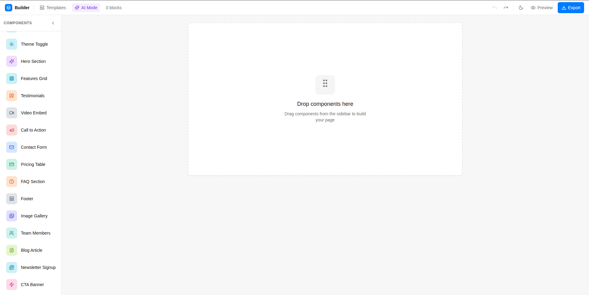
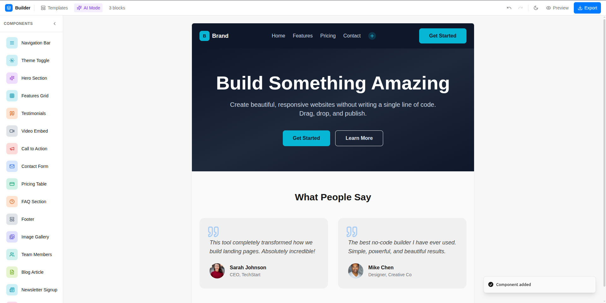
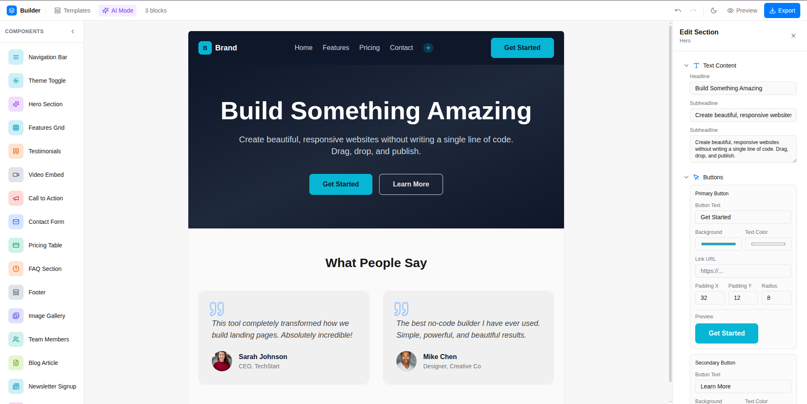
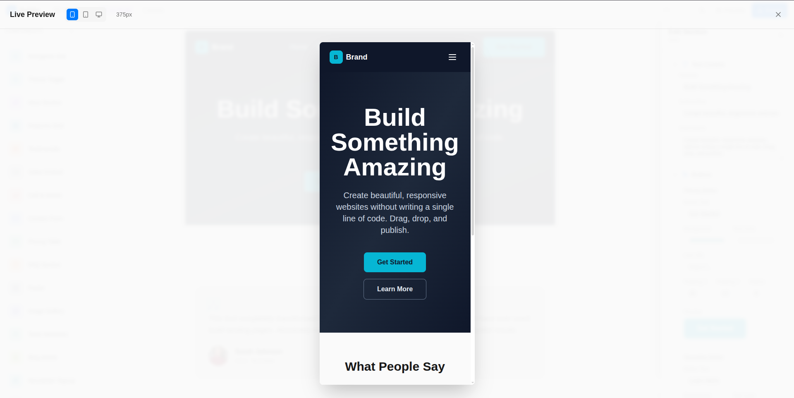
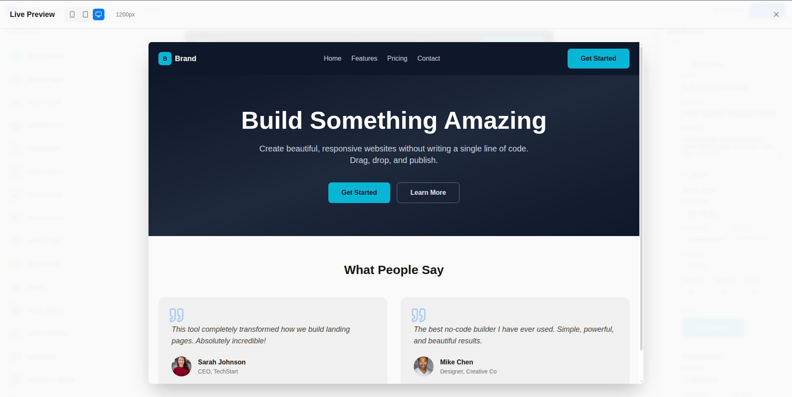

# BuildSpace – Visual Landing Page & Section Builder

A drag-and-drop React builder for landing pages and marketing sites.  
Compose sections like hero, features, testimonials, pricing, and more, tweak every detail in side panels, and export a production-ready layout in minutes.

---

## Table of Contents

- [Demo](#demo)
- [Why BuildSpace?](#why-buildspace)
- [Features](#features)
- [Screenshots](#screenshots)
- [Quick Start](#quick-start)
- [Usage Guide](#usage-guide)
  - [1. Create a New Page](#1-create-a-new-page)
  - [2. Add Sections from the Sidebar](#2-add-sections-from-the-sidebar)
  - [3. Edit Content In-Place](#3-edit-content-in-place)
  - [4. Fine-Tune Styles](#4-fine-tune-styles)
  - [5. Use AI Layout Generation](#5-use-ai-layout-generation)
  - [6. Preview & Export](#6-preview--export)
- [Architecture Overview](#architecture-overview)
  - [Domain Model](#domain-model)
  - [Builder Flow](#builder-flow)
- [Tech Stack](#tech-stack)
- [Project Structure](#project-structure)
- [Local Development](#local-development)
- [Roadmap & Ideas](#roadmap--ideas)
- [Contributing](#contributing)
- [License](#license)

---

## Demo

> Add links here when ready.

- Live demo: `https://buildspace-phoenix.vercel.app/`  
- Video walkthrough: `https://drive.google.com/file/d/1F7kkRy5I2Ia7Yy7jk1fvExo7-DT8t2xB/view?usp=sharing`

---

## Why BuildSpace?

Hackathons and product sprints live or die on speed of iteration. Designers want pixel-perfect control. Developers want clean code. Stakeholders want to see something working now.

**BuildSpace** bridges that gap:

- Turn vague product ideas into concrete, shippable landing pages in minutes.
- Drag, drop, and reorder high-quality, pre-built sections.
- Use AI-assisted layout generation to bootstrap an entire page from a plain-English prompt.
- Export a production-ready layout backed by a modern React + Tailwind stack.

---

## Features

### Builder Experience

- **Drag-and-drop canvas**
  - Reorder sections via drag-and-drop (`@dnd-kit/core`, `@dnd-kit/sortable`).
  - Visual overlay while dragging to understand layout impact.
- **Rich section library**
  - Navbar, hero, features, testimonials, pricing, team, gallery, contact, newsletter, CTA, FAQ, and more.
  - Each section has curated default copy so the page looks good even before editing.
- **Template presets**
  - Pre-built page templates (e.g. landing page, portfolio, product) built from section combinations.
  - One-click loading of templates to instantly bootstrap a layout.

### Editing & Customization

- **In-place content editing**
  - Click on text, buttons, or images to edit them via focused side panels.
  - Support for multiline text, links, and new-tab behavior.
- **Section style editor**
  - Control padding, margins, background color/gradient/image, overlays, and typography via a dedicated editor.
- **Theme toggles**
  - Separate themes for:
    - The **preview canvas** (light/dark).
    - The **editor chrome** itself (light/dark).

### AI-Assisted Layouts

- **Prompt-based generation**
  - Type a prompt like:
    - “SaaS landing page with hero, features, pricing, testimonials, FAQ.”
    - “Portfolio with hero, gallery, and contact.”
  - The builder:
    - Always adds navbar + footer.
    - Adds sections based on keywords (hero, features, testimonials, pricing, team, gallery, contact, newsletter, CTA, FAQ).
    - Replaces the current layout with a coherent new page.
- **Real-time feedback**
  - Toasts notify you of how many sections were generated, or if the prompt is too vague.

### Productivity & UX

- **Undo/redo with history**
  - Dedicated `undo` / `redo` buttons wired to an explicit history stack.
  - Every structural change (add/reorder/delete) is tracked.
- **Auto-persistence**
  - Canvas state saved to `localStorage` under `builder-blocks`.
  - Refresh the page and your layout is still there.
- **Preview & export**
  - Full-screen preview mode to see the page as visitors do.
  - Export the current configuration via an export modal.

### Developer-Friendly

- **Modern stack**
  - React 18, TypeScript, Vite, Tailwind CSS, shadcn-ui, React Router.
  - `@tanstack/react-query` wired for future data integrations.
- **Composable architecture**
  - Blocks rendered via a centralized `BlockRenderer`.
  - Data-driven templates allow you to add new sections without rewriting core logic.

---

## Screenshots

> Replace the image paths below with your actual screenshots.  
> You can also add GIFs to showcase drag-and-drop and AI generation.

- Builder overview (canvas + sidebar + editor):
  - 
- Drag-and-drop sections:
  - 
- Section style editor:
  - 
- Export & preview:
  - 
  - 

---

## Quick Start

### Prerequisites

- Node.js (recommended: ≥ 18)
- npm

### Installation

```bash
# Install dependencies
npm install

# Start the dev server (Vite, default port 8080)
npm run dev

# Build for production
npm run build

# Preview the production build locally
npm run preview

# Lint the codebase
npm run lint
```

Then open the URL printed by `npm run dev` (typically `http://localhost:8080`).

---

## Usage Guide

### 1. Create a New Page

1. Start the dev server: `npm run dev`.
2. Open the app in your browser.
3. You’ll land on the main builder screen:
   - Toolbar at the top.
   - Component sidebar on the left.
   - Canvas in the middle.
   - Contextual panels on the right.

### 2. Add Sections from the Sidebar

- Browse the **Components Sidebar** for available sections.
- Each entry shows:
  - Icon
  - Name
  - Short description
- **Drag** a component from the sidebar:
  - Drop it onto the canvas to append it.
  - Drop it between existing sections to insert it at that position.

### 3. Edit Content In-Place

- Click a section on the canvas to select it.
- Use:
  - **Text Edit Panel** to change headlines, body copy, and links.
  - **Button Edit Panel** to tweak label, colors, padding, radius, and link behavior.
  - **Image Edit Panel** to change image URL, alt text, overlay color, and radius.
- Changes are reflected immediately on the canvas.

### 4. Fine-Tune Styles

- With a section selected, open the **Section Editor Panel**:
  - Adjust spacing (top/bottom padding and margins).
  - Configure background:
    - Solid colors
    - Gradients
    - Background images with overlays
  - Tweak typography settings depending on the block.

### 5. Use AI Layout Generation

- Open the **AI Prompt Modal** from the toolbar.
- Enter a natural-language prompt, for example:
  - “Landing page with hero, features, pricing, testimonials, FAQ.”
  - “Team portfolio with hero, gallery, and contact.”
- The builder will:
  - Always include **navbar** and **footer**.
  - Add sections based on keywords.
  - Replace the current layout with a new one.
- A toast notifies you of how many sections were generated.

### 6. Preview & Export

- **Preview**
  - Use the **Preview** button in the toolbar.
  - See a full-page view of the current layout (respecting the preview theme).
- **Export**
  - Use the **Export** button.
  - Copy the exported configuration/layout for use in your own codebase or deployment setup.

---

## Architecture Overview

### Domain Model

Core types live in `src/types/builder.ts`:

- `ComponentType`
  - A union of all section types (e.g. `'navbar'`, `'hero'`, `'features'`, `'testimonials'`, `'pricing'`, `'team'`, `'imageGallery'`, `'contact'`, `'newsletter'`, `'cta'`, `'faq'`, `'footer'`, etc.).
- `BlockStyles`
  - Visual and layout-related data (padding, margin, background color/gradient/image, typography, overlays, etc.).
- `ComponentBlock`
  - One instance on the canvas:
    - `id`: unique string.
    - `type`: `ComponentType`.
    - `content`: `Record<string, string>` for block-specific fields.
    - `styles?`: `BlockStyles`.
- `ComponentTemplate`
  - Defines a reusable template for a block type:
    - `type`
    - `label`, `icon`, `description`
    - `defaultContent`
    - Optional `defaultStyles`

### Builder Flow

The main builder screen is `src/pages/Index.tsx`:

- **State management**
  - Uses `useBuilderHistory(initialBlocks)` to manage:
    - `{ past, present, future }` history.
    - `setBlocks`, `undo`, `redo`, `canUndo`, `canRedo`.
  - Auto-saves `present` into `localStorage` under `builder-blocks`.
- **Drag-and-drop**
  - `DndContext` + `SortableContext` from `@dnd-kit`:
    - Draggable items in the sidebar represent templates.
    - Dropping onto the canvas either inserts or appends a new `ComponentBlock`.
    - Reordering is done via `arrayMove`.
- **Panels & modals**
  - Top toolbar (`BuilderToolbar`):
    - Undo/redo
    - Theme toggles
    - Layout overview
    - Templates modal
    - AI prompt modal
    - Preview & export
  - Right-side panels:
    - `SectionEditorPanel` for styles.
    - `ButtonEditPanel`, `TextEditPanel`, `ImageEditPanel` for fine-grained editing.
  - Modals:
    - `PreviewModal`
    - `ExportModal`
    - `LayoutOverviewModal`
    - `TemplatesModal`
    - `AIPromptModal`
- **AI generation**
  - Keyword-based logic in `Index.tsx` drives which templates are instantiated based on a prompt string.

---

## Tech Stack

- **Frontend**
  - React 18
  - TypeScript
  - React Router (`react-router-dom`)
  - Tailwind CSS + `tailwindcss-animate`
  - shadcn-ui (Radix-based UI primitives under `src/components/ui`)
  - `lucide-react` icons
- **Builder / UX**
  - `@dnd-kit/core`, `@dnd-kit/sortable`, `@dnd-kit/utilities` for drag-and-drop.
  - `framer-motion` for animations.
  - `sonner` and shadcn Toaster for notifications.
- **State & Data**
  - `@tanstack/react-query` for query client/context.
  - `react-hook-form` + `zod` for forms and validation (available where needed).
- **Tooling**
  - Vite + `@vitejs/plugin-react-swc`
  - ESLint (flat config with React + TypeScript)
  - Tailwind + PostCSS
  - TypeScript compiler

---

## Project Structure

```text
.
├── package.json           # Scripts, dependencies
├── vite.config.ts         # Vite config + path alias @ -> src
├── tsconfig*.json         # TypeScript configs
├── tailwind.config.ts     # Tailwind setup and design tokens
├── src
│   ├── main.tsx           # React entry point
│   ├── App.tsx            # App shell, routing, providers
│   ├── pages
│   │   ├── Index.tsx      # Main builder screen
│   │   └── NotFound.tsx   # 404 page
│   ├── components
│   │   ├── builder        # Builder UI + panels + modals
│   │   │   ├── BuilderCanvas.tsx
│   │   │   ├── ComponentSidebar.tsx
│   │   │   ├── BuilderToolbar.tsx
│   │   │   ├── PreviewModal.tsx
│   │   │   ├── ExportModal.tsx
│   │   │   ├── LayoutOverviewModal.tsx
│   │   │   ├── TemplatesModal.tsx
│   │   │   ├── AIPromptModal.tsx
│   │   │   ├── SectionEditorPanel.tsx
│   │   │   ├── ButtonEditPanel.tsx
│   │   │   ├── TextEditPanel.tsx
│   │   │   └── ImageEditPanel.tsx
│   │   └── ui             # shadcn-ui primitives and wrappers
│   ├── data
│   │   ├── componentTemplates.ts  # Section palette definitions
│   │   └── projectTemplates.ts    # Page-level templates
│   ├── hooks
│   │   ├── useBuilderHistory.ts   # Undo/redo for blocks
│   │   └── use-mobile.tsx, use-toast.ts
│   ├── lib
│   │   └── utils.ts               # Shared utilities (e.g. cn)
│   └── types
│       └── builder.ts             # Core domain model types
└── ...
```

---

## Local Development

Common commands:

```bash
# Install dependencies
npm install

# Start dev server
npm run dev

# Production build
npm run build

# Preview production build
npm run preview

# Lint
npm run lint
```

For best hackathon UX:

- Add a `.env.example` if you introduce environment variables.
- Add a `scripts` section in `package.json` for any extra workflows you introduce (e.g. tests, format).

---

## Roadmap & Ideas

Some directions to showcase during judging:

- **Richer AI**
  - Generate copy and imagery (headlines, testimonials, pricing plans) using LLMs.
  - Suggest variants of an existing section for A/B testing.
- **Export targets**
  - Export to:
    - Static HTML + Tailwind CSS.
    - Next.js / Remix / Astro components.
- **Collaboration features**
  - Shareable preview links.
  - Multi-user editing with presence indicators.
- **Design system integration**
  - Sync tokens with external design systems (Figma, Tokens Studio).
  - Theme switcher presets for different brands.
- **Analytics-aware blocks**
  - Built-in tracking hooks (e.g. CTA clicks) that integrate with analytics tools.

These can be used as talking points or future work in your hackathon presentation.

---

## Contributing

For now, this project is optimized for fast iteration in a hackathon / prototype setting.

If you’d like to extend it:

1. Fork the repo.
2. Create a feature branch.
3. Add or extend block types by:
   - Updating `src/types/builder.ts`.
   - Adding templates in `src/data/componentTemplates.ts` and `src/data/projectTemplates.ts`.
   - Implementing renderers under `src/components/builder/blocks/`.
4. Open a pull request with a short demo description.

---

## License

Specify your license here (for example, MIT is common for hackathon projects).

```text
MIT License (recommended)
Copyright (c) YEAR YOUR_NAME
...
```

> Replace this section with your actual license text and/or a `LICENSE` file in the root.
